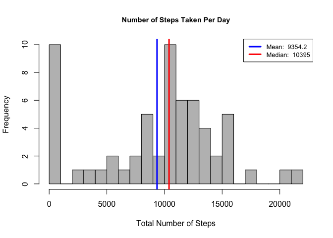
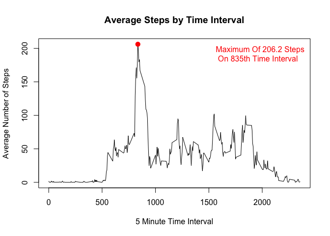
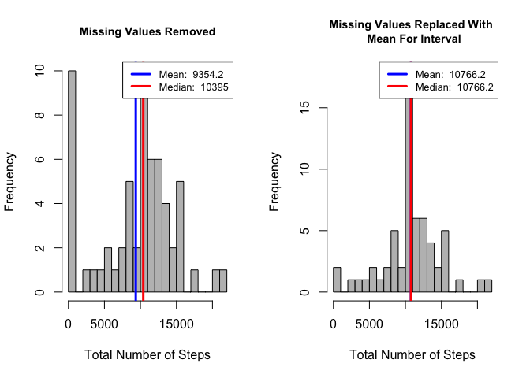

# Reproducible Research: Peer Assessment 1

**This document contains my complete work for peer assignment #1 towards submission in Session 2 of Coursera Reproducable Research class.**

###Loading & Preprocessing Data

First, I will remove all variables from the environment

```r
#removes all variables from environment
rm(list=ls(all=TRUE)) 
```

### Defining Working Directory

```r
ifelse(!dir.exists(file.path("~/", "Activity")), dir.create(file.path("~/", "Activity")), FALSE)
```

```
## [1] FALSE
```

```r
setwd("~/Activity")

ifelse(!dir.exists(file.path("~/Activity/", "Figures")), dir.create(file.path("~/Activity", "Figures")), FALSE)
```

```
## [1] FALSE
```


###Loading & Preprocessing Data
Now in this code chunk, I will download the dataset required for this assignment. From website: "https://d396qusza40orc.cloudfront.net/repdata%2Fdata%2Factivity.zip""

### Loading relevant library for restructuring and aggregating the data

```r
library(reshape2)
library(data.table)
```

```
## 
## Attaching package: 'data.table'
```

```
## The following objects are masked from 'package:reshape2':
## 
##     dcast, melt
```

```r
library(ggplot2)
library(lattice)
```

### defining the file name

```r
filename <- "repdata_data_activity.zip"
```

### Downloading and unzipping the dataset:

```r
if (!file.exists(filename)){
  fileURL <- "https://d396qusza40orc.cloudfront.net/repdata%2Fdata%2Factivity.zip"
  download.file(fileURL, filename, method="curl")
}  
if (!file.exists("Acitivity Monitoring Dataset")) { 
  unzip(filename) 
}
```


*This assignment makes use of data from a personal activity monitoring device. This device collects data at 5 minute intervals through out the day. The data consists of two months of data from an anonymous individual collected during the months of October and November, 2012 and include the number of steps taken in 5 minute intervals each day.*


The variables included in this dataset are:

steps: Number of steps taking in a 5-minute interval (missing values are coded as 𝙽𝙰)
date: The date on which the measurement was taken in YYYY-MM-DD format
interval: Identifier for the 5-minute interval in which measurement was taken

In the code chunk below, I will read this data into a dataframe and inspect the structure of the data

### Rading & making data set


```r
activityData <- read.csv('activity.csv', header = T)
names(activityData)
```

```
## [1] "steps"    "date"     "interval"
```

```r
str(activityData)
```

```
## 'data.frame':	17568 obs. of  3 variables:
##  $ steps   : int  NA NA NA NA NA NA NA NA NA NA ...
##  $ date    : Factor w/ 61 levels "2012-10-01","2012-10-02",..: 1 1 1 1 1 1 1 1 1 1 ...
##  $ interval: int  0 5 10 15 20 25 30 35 40 45 ...
```

```r
head(activityData)
```

```
##   steps       date interval
## 1    NA 2012-10-01        0
## 2    NA 2012-10-01        5
## 3    NA 2012-10-01       10
## 4    NA 2012-10-01       15
## 5    NA 2012-10-01       20
## 6    NA 2012-10-01       25
```

```r
dim(activityData)
```

```
## [1] 17568     3
```


###Histogram, Mean & Median

Now, we will process data and design a histogram of the total number of steps taken each day, but first we will summarize the data by day:


```r
act_tbl = data.table(activityData)
act_tbl_summary = act_tbl[, list(total_steps = sum(steps, na.rm = T)), 
                          by = date]
```

**Making the Histogram, And Reporting on Mean and Median:**

The below histogram addresses the following items:

1.  Make a histogram of the total number of steps taken each day
2.  Calculating and reporting the mean and median total number of steps taken per day

**PS: Mean and median values are shown in histogram**


```r
# Designing a histogram plot function which can be resused later
## to output the graph on a files please uncomment following code    
##      jpeg(file = "~/Activity/Figures/myplot1.jpg")
des_hist = function(x, title){
        hist(x, 
             breaks = 20,
             main = title,
             xlab = 'Total Number of Steps', col = 'grey',
            
             cex.main = .9)
        
        #calculating mean and median
        mean_value = round(mean(x), 1)
        median_value = round(median(x), 1)
        
        #drawing lines for mean and median on histogram
        abline(v=mean_value, lwd = 3, col = 'blue')
        abline(v=median_value, lwd = 3, col = 'red')
        
        #Displaying legend
        legend('topright', lty = 1, lwd = 3, col = c("blue", "red"),
               cex = .8, 
               legend = c(paste('Mean: ', mean_value),
               paste('Median: ', median_value))
               )
    
}

des_hist(act_tbl_summary$total_steps, 'Number of Steps Taken Per Day')
```

<!-- -->

```r
## After output in Jpeg fromat closing the device
## dev.off()
```
## What is mean total number of steps taken per day?
## Ans: 

###Daily Activity Pattern

----------------------------


**Visulaizing daily activity pattern**

The below plot addresses the following items:

1.  Making a time series plot (i.e. type = "l") of the 5-minute interval (x-axis) and the average number of steps taken, averaged across all days (y-axis)
2.  Which 5-minute interval, on average across all the days in the dataset, contains the maximum number of steps?


```r
#summarize dataset by interval
act_tbl_summary_intv = act_tbl[, list(avg_steps = mean(steps, na.rm = T)), 
                          by = interval]

## to output the graph on a files please uncomment following code    
##     jpeg(file = "~/Activity/Figures/myplot2.jpg")

#plotting the time series
with(act_tbl_summary_intv, {
        plot(interval, avg_steps, type = 'l',
             main = 'Average Steps by Time Interval',
             xlab = '5 Minute Time Interval',
             ylab = 'Average Number of Steps')
        })

#Finding interval that has maximum average steps

max_avg_steps = act_tbl_summary_intv[which.max(avg_steps), ]

#Generating Labels

max_lab = paste('Maximum Of ', round(max_avg_steps$avg_steps, 1), ' Steps \n On ', max_avg_steps$interval, 'th Time Interval', sep = '')

#Collecting cooridinates of the max interval for charting
points(max_avg_steps$interval,  max_avg_steps$avg_steps, col = 'red', lwd = 3, pch = 19)

#Add Label To Annotate Maximum # Steps And Interval
legend("topright",
       legend = max_lab,
       text.col = 'red',
       bty = 'n'
       )
```

<!-- -->

```r
## After output in Jpeg fromat closing the device
## dev.off()  
```

---

###Missing Values Treatment

1. Counting and reporting The Number of Missing Values

```r
sum(is.na(act_tbl$steps))
```

```
## [1] 2304
```

### Tasks

1. Devising a strategy for filling in all of the missing values in the dataset. The strategy does not need to be sophisticated. For example, you could use the mean/median for that day, or the mean for that 5-minute interval, etc.

2. Creating a new dataset that is equal to the original dataset but with the missing data filled in.


```r
#Joining the dataframe created earlier to summarizes the average number of steps per interval to the original dataset

setkey(act_tbl, interval)
setkey(act_tbl_summary_intv, interval)


#Desiging a fucnction return the second value if the first value is NA

NA_Subs = function(x,y){
        if(is.na(x)){
                
                return(y)
        }
        return(x)
}

#Designing dataset that replaces NAs with average values

act_tbl_clean = act_tbl[act_tbl_summary_intv]
act_tbl_clean$new_steps = mapply(NA_Subs,act_tbl_clean$steps, act_tbl_clean$avg_steps)

#summaryize new dataset by day

act_tbl_summary_clean = act_tbl_clean[, list(new_steps = sum(new_steps, na.rm = T)), by = date]

#preview of new dataset
head(act_tbl_summary_clean)
```

```
##          date new_steps
## 1: 2012-10-01  10766.19
## 2: 2012-10-02    126.00
## 3: 2012-10-03  11352.00
## 4: 2012-10-04  12116.00
## 5: 2012-10-05  13294.00
## 6: 2012-10-06  15420.00
```

4.  Make a histogram of the total number of steps taken each day and Calculate and report the mean and median total number of steps taken per day. Do these values differ from the estimates from the first part of the assignment? What is the impact of imputing missing data on the estimates of the total daily number of steps?

**Note: Mean and Median Are Reported In Legend Of Histogram**


```r
## to output the graph on a files please uncomment following code    
##     jpeg(file = "~/Activity/Figures/myplot3.jpg")

par(mfrow = c(1,2))
des_hist(act_tbl_summary$total_steps, 'Missing Values Removed')
des_hist(act_tbl_summary_clean$new_steps, 'Missing Values Replaced With \n Mean For Interval')
```

<!-- -->

```r
## After output in Jpeg fromat closing the device
## dev.off() 
```

**Answer To Question:**
The mean and the median are now almost the same after replacing missing values with the mean value for the relevant interval. It makes more sense that the median value would now move closer to the mean. Therefore, the Median value increased after this method of missing value replacement.

###Are there differences in activity patterns between weekdays and weekends?

---
1.  Creating a new factor variable in the dataset with two levels – “weekday” and “weekend” indicating whether a given date is a weekday or weekend day.


```r
#Making function to return "Weekday" or "Weekend"
weekpart = function(x){
        if(x %in% c('Saturday', 'Sunday')){
                return('Weekend')
        }
        
        return('Weekday')
}

#Adding name of the week
act_tbl_clean$dayname = weekdays(as.Date(act_tbl_clean$date))

#Adding factor variable to differentiate between weekday & weekend
act_tbl_clean$daytype = as.factor(apply(as.matrix(act_tbl_clean$dayname), 1, weekpart))

#Summarizing Dataset: Mean grouped by interval and daytype
act_tbl_summary_clean = act_tbl_clean[, list(avg_steps = mean(new_steps, na.rm = T)), by = list(interval, daytype)]

#inspecting designed dataset in output
str(act_tbl_summary_clean)
```

```
## Classes 'data.table' and 'data.frame':	576 obs. of  3 variables:
##  $ interval : int  0 0 5 5 10 10 15 15 20 20 ...
##  $ daytype  : Factor w/ 2 levels "Weekday","Weekend": 1 2 1 2 1 2 1 2 1 2 ...
##  $ avg_steps: num  2.2512 0.2146 0.4453 0.0425 0.1732 ...
##  - attr(*, ".internal.selfref")=<externalptr>
```

Below is the panel plot:

```r
## to output the graph on a files please uncomment following code    
##     jpeg(file = "~/Activity/Figures/myplot3.jpg")

xyplot(avg_steps~interval | daytype, data = act_tbl_summary_clean,
      type = 'l',
      xlab = 'Interval',
      ylab = 'Number of Steps',
      layout = c(1,2))
```

<!-- -->

```r
## After output in Jpeg fromat closing the device
## dev.off() 
```

